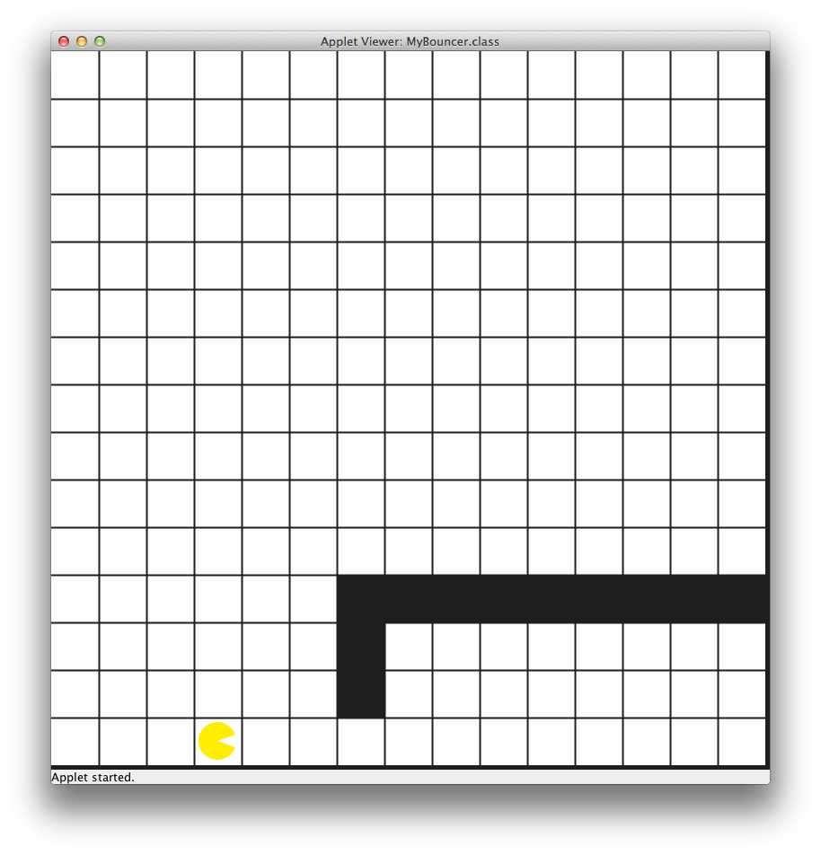
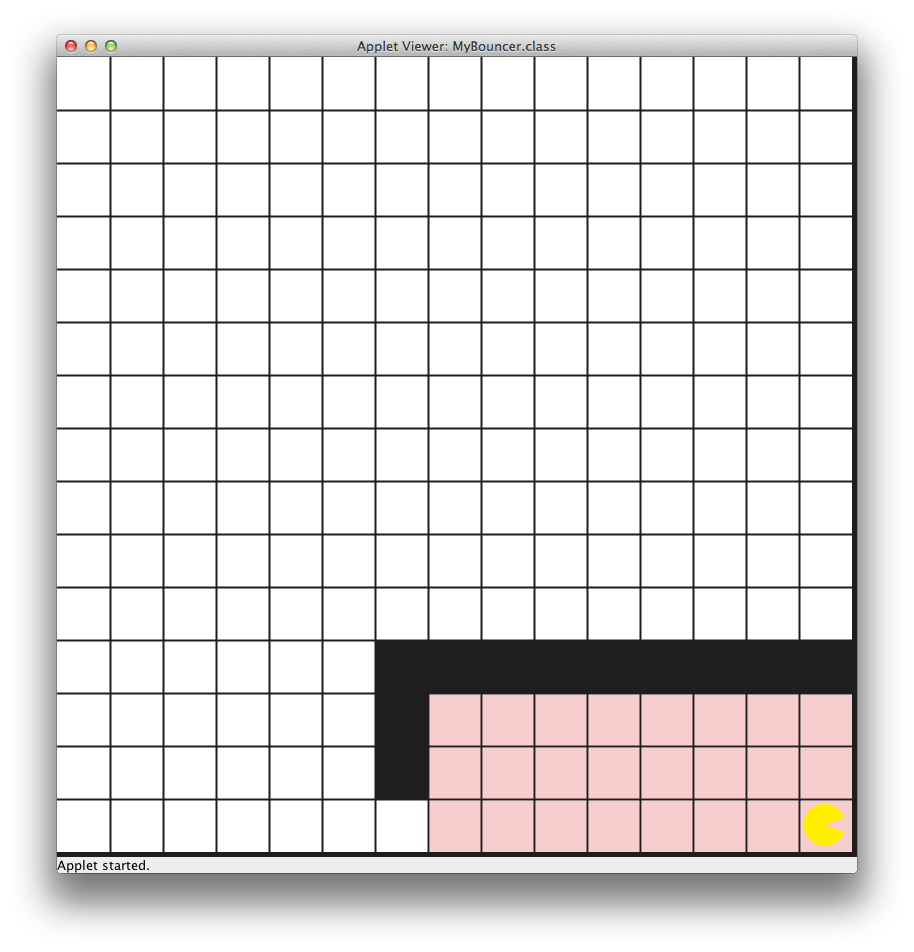

# U03 | Bouncer als Maler  

Lesen Sie die Aufgabenstellung gründlich durch und Vesuchen Sie, die beschriebenenen Probleme zuerst selbständig zu lösen. Grundlegende Informationen zum Umgang mit der Entwicklungsumgebung IntelliJ und zu den wichtigsten Bouncer-Befehlen finden Sie im GRIPS-Kurs. Bei Fragen stehen wir Ihnen per E-Mail oder im Discord zur Verfügung.

## Ausgangslage 
Bouncers Aufgabe in diesem Programm ist es, einen Raum komplett in rot zu streichen. Dazu muss er den Raum betreten und dort alle Felder rot anmalen. Der Raum ist durch gesperrte Felder von der restlichen Karte abgetrennt. Bouncer startet zwei Felder vor der *Tür*.  

| Bouncer steht vor dem nicht-gestrichenen Raum. | Bouncer steht im vollständig gestrichenen Raum. |
|:------:|:------:|
|  |  |

* Benutzen Sie die Karte **Painter** um die korrekte Welt zu laden*. Ihr Programm sollte jedoch allgemein genug verfasst sein, um auch andere Räume verabeiten zu können. Sie können die Allgemeingültigkeit Ihres Programmes mit der Karte **Painter_large** testen. 

Es gelten folgende Annahmen:  

* Der Raum befindet sich östlich von Bouncer  
* Bouncer startet immer am unteren Rand der Karte, steht mindestens ein Feld vor der *Tür* und schaut nach Osten  
* Die Öffnung (*Tür*) ist ein Feld breit und hoch und befindet sich auf gleicher Höhe mit Bouncers Startposition  
* Der Raum kann auf der Karte beliebig hoch und breit sein  
* Bis auf die Öffnung ist der Raum durch blockierte Felder bzw. den Kartenrand umgeben  
* Nachdem Bouncer den Raum betreten hat und auf dem ersten Feld hinter der Tür steht, soll er mit dem Streichen beginnen. Dabei arbeitet er     senkrecht vom Boden zur Decke und bewegt sich danach - am Boden - ein Feld Richtung Osten um erneut vom Boden bis zur Decke alle Felder der aktuellen *Spalte* anzumalen.  

## Aufgabe
Zerlegen Sie die Hauptaufgabe in sinnvolle Teilbereiche, die Sie  nacheinander bearbeiten. Überlegen Sie sich, welche Bedingungen oder Zustände auftreten, die das Ende bzw. den Start einer der Teilaufgaben beschreiben:  

1. Betreten des Raums  
2. Klettern bis zur Decke und Streichen aller Felder  
3. Rückkehr zum Boden und Wechsel zum nächsten Feld  
4.  Weitermachen, bis Bouncer den Raum komplett gestrichen hat
